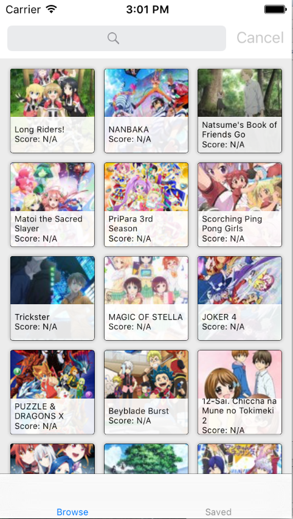
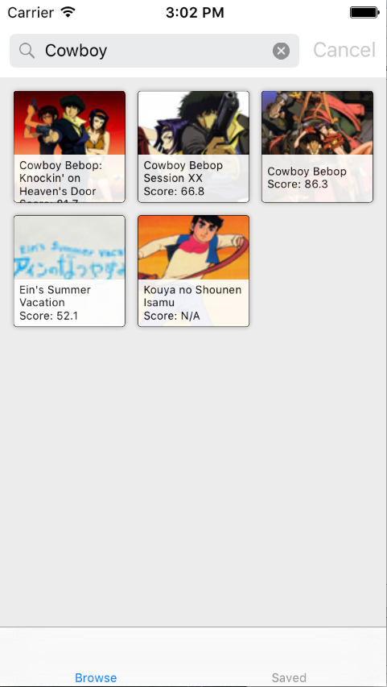
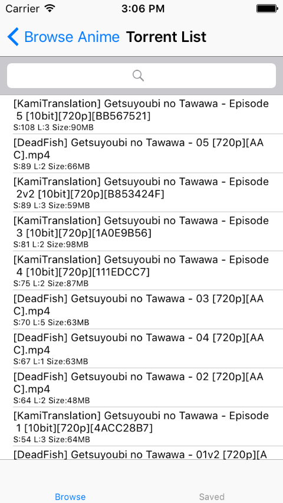
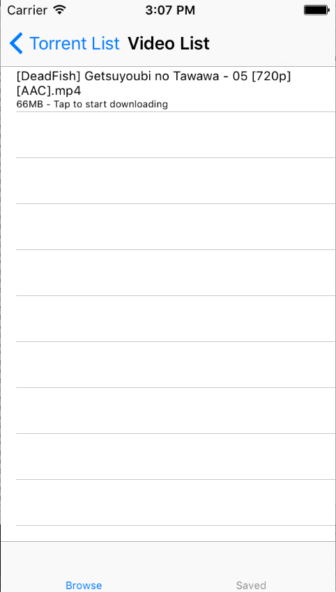
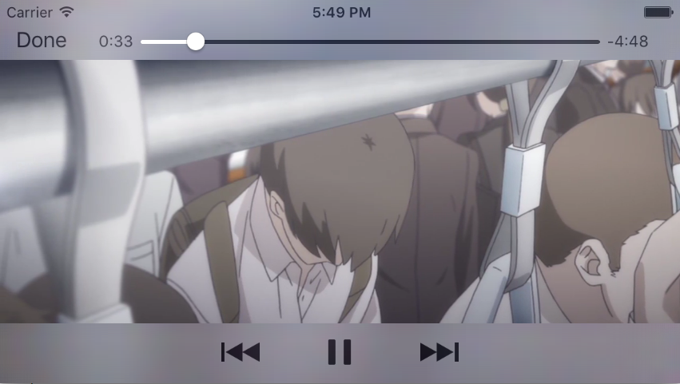

# TheAnimeTool
This tool is currently in slow development.

This is early experimental app only for learning at this moment. Will be rebuilt in the near future.

## Introduction
A convenient tool that uses anilist API  and nyaa tracker for iOS anime watching.

## TODO
0. Rebuild modules & relationships
1. User torrent storage
2. Universal media player intergration
3. Update UI UX
